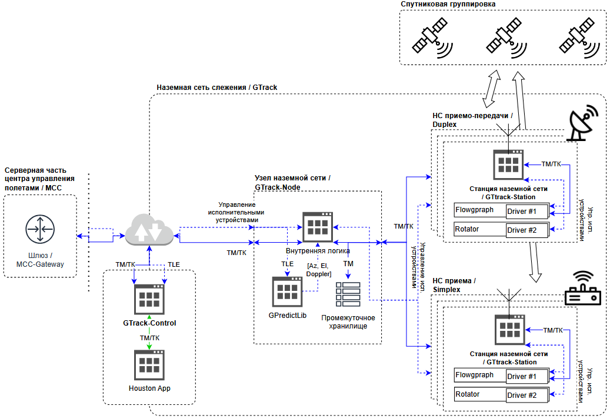

# GTrack (Наземная сеть слежения)

Распределенная сеть наземных станций для спутниковой связи и управления, состоящая из узлов слежения (`GTrack-Node`), наземных станций (`GTrack-Station`) и интерфейсов центра управления полетами (`MCC-Gateway`, `GTrack-Control`).

## Архитектурный обзор

GTrack — иерархическая сеть для надежной спутниковой связи и автоматического управления антеннами.

### Структурная схема

## Компоненты системы

### MCC Gateway
Сервер для автоматического управления полетами. Подключается к нескольким `GTrack-Node`.

### GTrack Control
Десктопное приложение для ручного управления при недоступности автоматизированного сервера.

### GTrack Node
Программный компонент, разворачиваемый в каждом пункте управления. Шлюз между Центром управления и станциями.

**Функции:**
- Аутентификация подключений
- Управление сессиями
- Маршрутизация данных
- Обработка TLE (Gpredict)
- Хранение телеметрии

### GTrack Station
ПО для управления оборудованием станции (антенны, радиомодули). Подключается к одному Node.

**Функции:**
- Управление оборудованием (GNU Radio, ротаторы)
- Выполнение команд Az/El/Doppler
- Обработка телеметрии
- Конфигурация оборудования

## Протоколы и данные

- Межкомпонентная связь: gRPC, TCP-сокеты  
- Связь с оборудованием: специфичные протоколы  

Типы данных: телекоманды, телеметрия, команды управления оборудованием.
